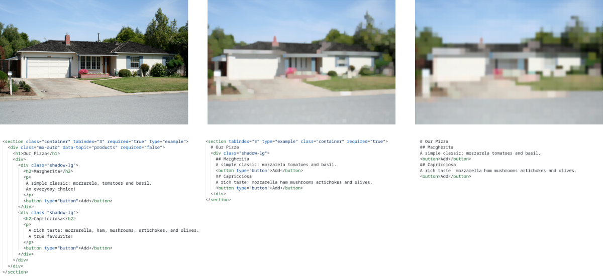

<h1 align="center">D2Snap</h1>



**D2Snap** is a first-of-its-kind DOM downsampling algorithm, designed for use with LLM-based web agents.

##

### Integrate

``` ts
D2Snap.d2Snap(
  dom: DOM,
  r_e: number, r_a: number, r_t: number,
  options?: Options
): Promise<{
  html: string;
  meta: {};
}>

D2Snap.adaptiveD2Snap(
  dom: DOM,
  maxTokens: number = 4096,
  maxIterations: number = 5,
  options?: Options
): Promise<{
  html: string;
  meta: {};
}>
```

``` ts
type DOM = Document | Element | string;
type Options = {
  debug?: boolean;                // false
  groundTruth: object;            // see variables/ground-truth.json
  keepUnknownElements?: boolean;  // false
  skipMarkdown?: boolean;         // false
  uniqueIDs?: boolean;            // false
};
```

#### Browser

``` html
<script src="https://cdn.jsdelivr.net/gh/webfuse-com/D2Snap@main/dist.browser/D2Snap.js"></script>
```

#### Module

``` console
npm install webfuse-com/D2Snap
```

> Install [jsdom](https://github.com/jsdom/jsdom) to use the library with Node.js:
> ``` console
> npm install jsdom
> ```

``` js
import * as D2Snap from "@webfuse-com/d2snap";
```

##

### Example

``` html
<section tabindex="3" class="container" required="true">
  # Our Pizza
  <div>
    <div class="shadow-lg">
      ## Margherita
      A simple classic mozzarela tomatoes and basil
      <button type="button">Add</button>
      ## Capricciosa
      A rich taste A true favourite
      <button type="button">Add</button>
    </div>
  </div>
</section>
```

<p align="center">↓ D2Snap ↓</p>

``` html
<section class="container" required="true">
  # Our Pizza
  <div class="shadow-lg">
    ## Margherita
    A simple classic
    <button>Add</button>
    ## Capricciosa
    A rich taste
    <button>Add</button>
  </div>
</section>
```

<p align="center">↓ D2Snap ↓</p>

``` html
<section>
  # Our Pizza
  ## Margherita
  A simple classic
  <button>Add</button>
  ## Capricciosa
  A rich taste
  <button>Add</button>
</section>
```

##

### Experiment

#### Setup

``` console
npm install
npm install jsdom
```

#### Build

``` console
npm run build
```

#### Test

``` console
npm run test
```

#### Evaluate

> Provide LLM API provider key(s) to .env (compare [example](./.env.example)).

``` console
npm run eval:<snapshot>
```

> `<snapshot>` ∈ { `gui`, `dom`, `bu`, `D2Snap` }

``` console
npm run eval:D2Snap -- --verbose --split 10,20 --provider openai --model gpt-4o
```

#### Re-create Snapshots

``` console
npm run snapshots:create
```

##

<p align="center">
    <strong>Beyond Pixels: Exploring DOM Downsampling for LLM-Based Web Agents</strong>
    <br>
    <sub><a href="https://github.com/t-ski" target="_blank">Thassilo M. Schiepanski</a></sub>
    &hairsp;
    <sub><a href="https://nl.linkedin.com/in/nicholasp" target="_blank">Nicholas Piël</a></sub>
    <br>
    <sub>Surfly BV</sub>
</p>