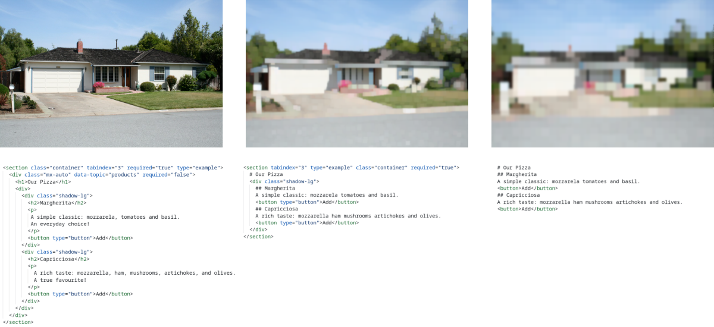

<h1 align="center">D2Snap</h1>



**D2Snap** is a first-of-its-kind DOM downsampling algorithm, designed for use with LLM-based web agents.

##

### Integrate

``` ts
D2Snap.d2Snap(
  dom: DOM,
  rE: number, rA: number, rT: number,
  options?: Options
): Promise<{
  html: string;
  meta: {};
}>

D2Snap.adaptiveD2Snap(
  dom: DOM,
  maxTokens: number = 4096,
  maxIterations: number = 5,
  options?: Options
): Promise<{
  html: string;
  meta: {};
  parameters: {};
  adaptiveIterations: number;
}>
```

``` ts
type DOM = Document | Element | string;
type Options = {
  debug?: boolean;            // false
  minify?: boolean;           // true
  outerHTML?: boolean;        // false
  uniqueIDs?: boolean;        // false
  attributeScoring?: {        // compare src/var.ATTRIBUTE_SCORING.ts
    [ name: string ]: number;
  };
  labelToText?: {
    iconFonts?: boolean;       // false
    tagNames?: string[];       // [ "IMG", "SVG" ]
  }>;
  skip?: {
    markdown?: boolean;       // false
    skipTextRank?: boolean;   // false
  };
};
```

> The attribute scoring lookup table supports wildcards for `aria` and `data` (`{aria-|data-}*`).

#### Browser

``` html
<script src="https://cdn.jsdelivr.net/gh/webfuse-com/D2Snap@main/dist.browser/D2Snap.js"></script>
```

#### Module

``` console
npm install webfuse-com/D2Snap
```

> Install [jsdom](https://github.com/jsdom/jsdom) to use the library with Node.js:
> ``` console
> npm install jsdom
> ```

``` js
import * as D2Snap from "@webfuse-com/d2snap";
```

##

### Example

``` html
<section class="container" tabindex="3" required="true" type="example">
  <div class="mx-auto" data-topic="products" required="false">
    <h1>Our Pizza</h1>
    <div>
      <div class="shadow-lg">
        <h2>Margherita</h2>
        <p>
         A simple classic: mozzarella, tomatoes and basil.
         An everyday choice!
        </p>
        <button type="button">Add</button>
      </div>
      <div class="shadow-lg">
        <h2>Capricciosa</h2>
        <p>
          A rich taste: mozzarella, ham, mushrooms, artichokes and olives.
          A true favourite!
        </p>
        <button type="button">Add</button>
      </div>
    </div>
  </div>
</section>
```

<p align="center">↓ D2Snap ↓</p>

``` html
<section class="container" required="true" type="example">
  <div class="mx-auto" required="false">
    # Our Pizza
    <div>
      ## Margherita
      A simple classic: mozzarella, tomatoes and basil.
      An everyday choice!
      <button type="button">Add</button>
      ## Capricciosa
      A rich taste: mozzarella, ham, mushrooms, artichokes and olives.
      A true favourite!
      <button type="button">Add</button>
    </div>
  </div>
</section>
```

<p align="center">↓ D2Snap ↓</p>

``` html
# Our Pizza
## Margherita
A simple classic: mozzarella, tomatoes and basil.
An everyday choice!
<button>Add</button>
## Capricciosa
A rich taste: mozzarella, ham, mushrooms, artichokes and olives.
A true favourite!
<button>Add</button>
```

##

### Experiments

#### Setup

``` console
npm install
npm install jsdom
```

#### Build

``` console
npm run build
```

#### Test

``` console
npm run test
```

##### Unit Test(s)

``` console
npm run test:unit
npm run test:unit -- <test-name> # e.g., D2Snap.option.filters
```

##### Regression Tests

``` console
npm run test:regression
```

#### Evaluate

> Provide LLM API provider key(s) to .env (compare [example](./.env.example)).

``` console
cs eval && pip install -r requirements.txt
```

##### Success Rate

``` console
npm run eval:success:<subject>
```

> `<subject>` ∈ { `gui`, `dom`, `bu`, `D2Snap` }

``` console
npm run eval:success:D2Snap -- --verbose --split 10,20 --provider openai --model gpt-4o
```

> Does use the LLM backend.

##### Size Ratio

``` console
npm run eval:ratio
```

> Does not use the LLM backend.

#### Re-create Snapshots

``` console
npm run snapshots:create
```

> 

##

<p align="center">
  <strong>Beyond Pixels: Exploring DOM Downsampling for LLM-Based Web Agents</strong>
  <br>
  <sub><a href="https://github.com/t-ski" target="_blank">Thassilo M. Schiepanski</a></sub>
  &hairsp;
  <sub><a href="https://nl.linkedin.com/in/nicholasp" target="_blank">Nicholas Piël</a></sub>
  <br>
  <sub>Surfly BV</sub>
</p>